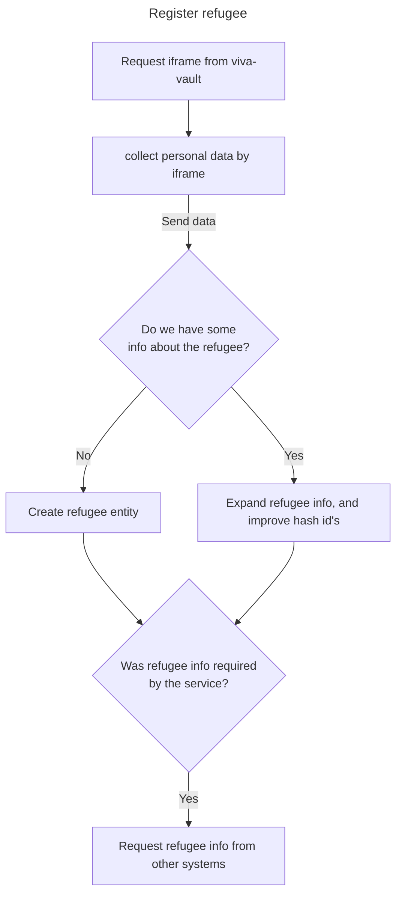
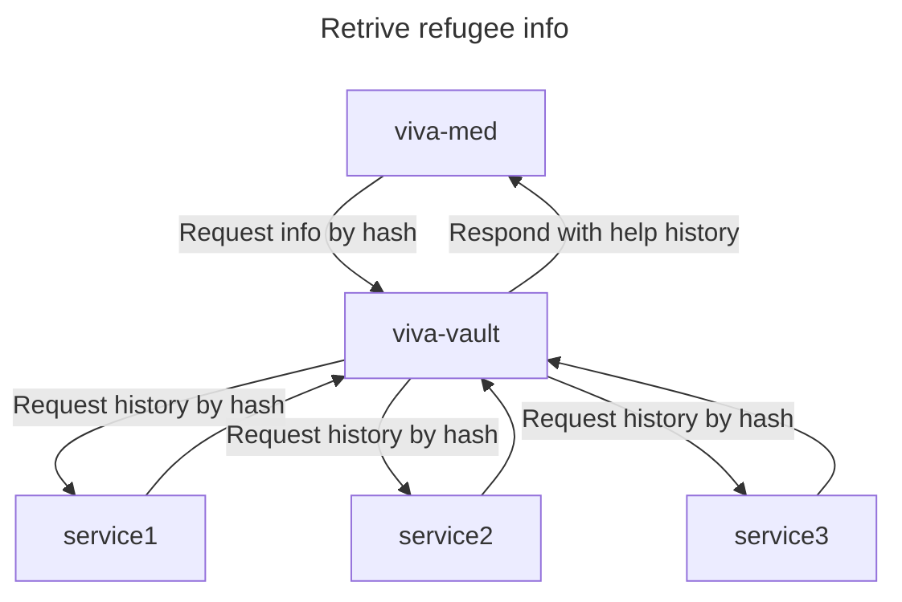

# Full structure of the project

This project use microservices architecture. Each service is a separate project. All documentation is compiled in this project.

## Services

- [viva-vault](https://github.com/Viva-foundation/viva-vault) - Vault service for storing and processing personal information of refugees and people in need of help.
- [viva-med](https://github.com/Viva-foundation/viva-med) - Medical service for storing and processing medical information and drug distribution.

## RFCs
- [PD conceps](/data/index)

## High level relations

